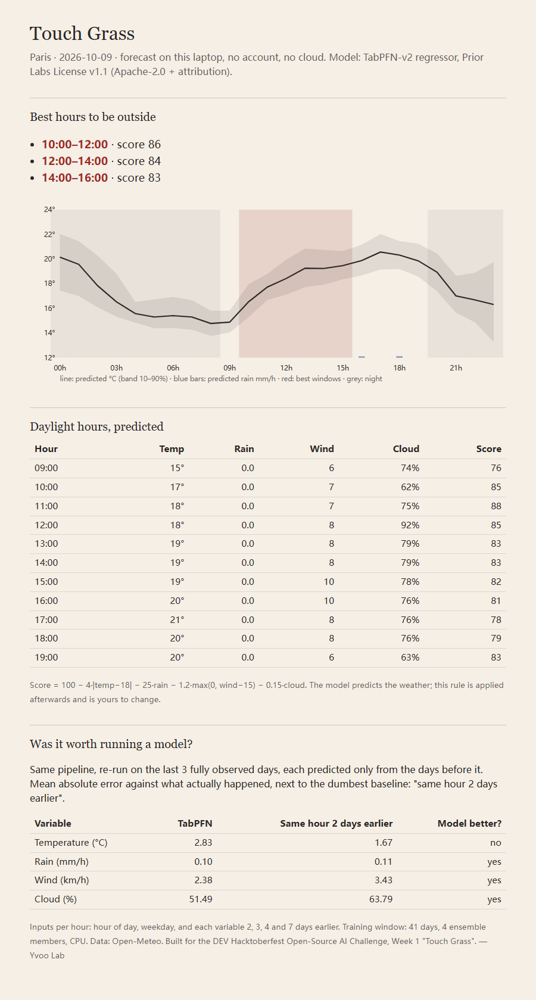

# Touch Grass

Which hours tomorrow are worth being outside, forecast on your own laptop from a plain CSV of past weather. No account, no API key, no GPU, no cloud. One Python file, one offline HTML page.

Built for the [DEV Hacktoberfest Open-Source AI Challenge, Week 1: Touch Grass](https://dev.to/challenges/hacktoberfest-week1-2026-10-05). The open-source AI at the core is [TabPFN](https://github.com/PriorLabs/TabPFN), Prior Labs' tabular foundation model.



Live page: https://yvoolab.github.io/touch-grass-tabpfn/ (regenerated by hand, not on a schedule; the date in the header is the day it was built for).

## What it does

1. Pulls about 70 days of hourly weather for one place from [Open-Meteo](https://open-meteo.com/) (free, no key). Saved to `data/<place>_hourly.csv` so the next run can be fully offline.
2. Turns it into a flat table: hour of day, weekday, and what temperature, rain, wind and cloud were 1, 2, 3 and 7 days earlier.
3. Fits one TabPFN regressor per variable on the last 41 days and predicts the target day hour by hour, with a 10–90% band.
4. Scores every daylight hour with a transparent rule (shown on the page, applied after prediction, yours to edit) and picks the three best two-hour windows.
5. Writes `docs/index.html`: inline SVG, no JavaScript, no external requests. Open it on a phone, then put the phone away.

If you run it before 18:00 it forecasts today; after, tomorrow. The baseline shifts accordingly so the model never sees anything that has not happened yet.

## The honesty check

Before forecasting, the same pipeline re-predicts the last three fully observed days, each from the days before it, and prints the mean absolute error next to the dumbest baseline there is: the same hour the day before. The page shows both numbers.

Paris, built 2026-10-08 for 2026-10-09:

| Variable | TabPFN | Same hour 2 days earlier | Model better? |
|---|---|---|---|
| Temperature (°C) | 2.83 | 1.67 | no |
| Rain (mm/h) | 0.10 | 0.11 | yes |
| Wind (km/h) | 2.38 | 3.43 | yes |
| Cloud (%) | 51.5 | 63.8 | yes |

On a stable October week, yesterday's temperature is hard to beat with 41 days of lags; the model wins on wind and cloud and ties on rain. That is what the numbers say, so that is what the page says. If you want the temperature line to win, the obvious next step is to add a numerical forecast as a feature, which would also make the project depend on someone else's model. I left it out on purpose: the point was a forecaster you fully own.

## Run it

```bash
pip install -r requirements.txt       # tabpfn 9.1.0 (CPU torch is fine), numpy
python touch_grass.py                 # Paris, auto today/tomorrow
python touch_grass.py --lat 45.76 --lon 4.84 --name Lyon --tz Europe/Paris
python touch_grass.py --csv data/paris_hourly.csv --day tomorrow   # offline
```

First run downloads the TabPFN v2 checkpoints (about 30 MB each, regressor only) into the TabPFN cache. On a laptop CPU the full run, honesty check included, takes 5–6 minutes: 16 fits of 984 rows. Set `TRAIN_DAYS` higher and `N_ESTIMATORS` to `"auto"` if you have a GPU.

## Why TabPFN v2 and not the newest checkpoint

`tabpfn` 9.1.0 defaults to TabPFN-3.5 weights, which are gated behind a Prior Labs account and a non-commercial license. The TabPFN-v2 weights are ungated on Hugging Face under the Prior Labs License v1.1 (Apache-2.0 plus attribution), run on CPU, and are selected with one line:

```python
TabPFNRegressor.create_default_for_version(ModelVersion.V2, device="cpu")
```

That is the whole reason this project can be a single file anyone can run without signing up for anything. Open weights with a permissive license are the difference between "try it in five minutes" and "create an account first".

## Attribution

TabPFN-v2 weights: Prior Labs, [Prior Labs License v1.1](https://huggingface.co/Prior-Labs/TabPFN-v2-reg/blob/main/LICENSE.txt).
Hollmann, N., Müller, S., Purucker, L. et al. *Accurate predictions on small data with a tabular foundation model.* Nature 637, 319–326 (2025). https://doi.org/10.1038/s41586-024-08328-6

Weather data: [Open-Meteo](https://open-meteo.com/), CC BY 4.0.

## License

Code: MIT. Model weights are downloaded at runtime and keep their own license.

— Yvoo Lab
